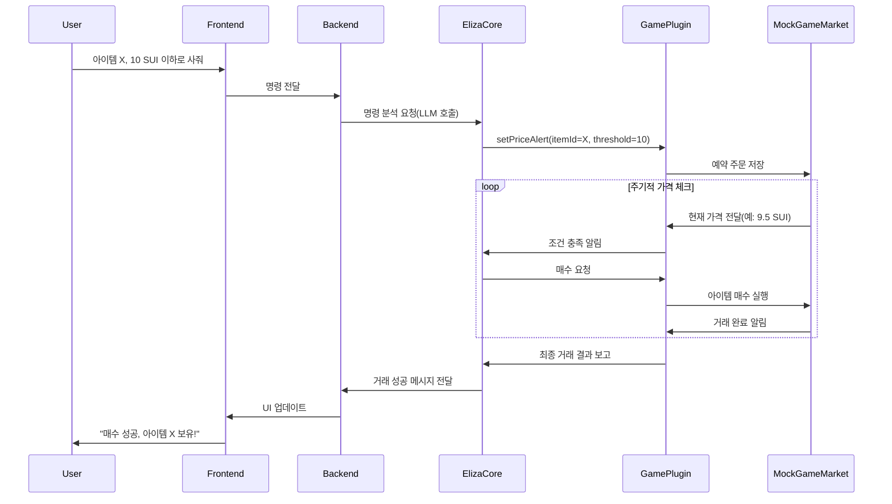

# playnvest-eliza
Play & Invest with Eliza OS

# AI Game & DeFi Assistant: Technical README

## 프로젝트 개요

본 프로젝트는 게이머가 게임 플레이에 집중할 수 있도록, Eliza AI Agent가 Sui 기반의 DeFi 투자 및 게임 아이템(모의)을 자동 관리해주는 대화형 시스템입니다.

## 핵심 기술 구성

- **Eliza OS**: AI 대화형 에이전트
- **Sui Blockchain Plugin**: DeFi 액션(스왑, 스테이킹 등)
- **Game Plugin**: Mock 게임 아이템 거래소
- **OpenAI LLM**: 자연어 해석 및 명령 처리
- **Frontend**: 채팅 인터페이스 및 포트폴리오 대시보드
- **Backend**: Eliza 서버, Mock 게임 데이터, 예약주문 스케줄러

## 시스템 아키텍처

### High-Level Flowchart

```mermaid
flowchart TD
    User[사용자 \n(게이머)] -->|명령 입력| FE[Frontend \n(Chat UI)]
    FE -->|REST/WebSocket| BE[Backend \n(Eliza OS 서버)]

    subgraph Eliza OS Server
        BE -->|자연어 처리 요청| LLM[OpenAI API \n(LLM)]
        LLM -->|해석된 명령| CORE[Eliza Core]
        CORE -->|DeFi 액션 호출| SuiPlugin[Sui Plugin]
        CORE -->|게임 액션 호출| GamePlugin[Game Plugin]
    end

    SuiPlugin -->|트랜잭션 실행| SuiBlockchain[Sui Blockchain \n(스왑, 스테이킹)]
    GamePlugin -->|아이템 매매 요청| MockGameMarket[Mock Game Market \n(아이템 거래/가격DB)]

    SuiBlockchain -->|결과 반환| SuiPlugin
    MockGameMarket -->|아이템 상태 업데이트| GamePlugin

    SuiPlugin --> CORE
    GamePlugin --> CORE

    CORE -->|최종 결과 전송| BE
    BE -->|JSON 응답| FE
    FE -->|화면 갱신| User
```

### 상세 Sequence Diagram (아이템 예약 매수 시나리오)



## 주요 컴포넌트 역할

### Frontend
- 사용자와 Eliza AI의 텍스트 채팅 인터페이스
- 자산 포트폴리오 상태 (DeFi 자산, 게임 아이템 목록, 예약 주문 내역) 표시

### Backend (Eliza OS)
- OpenAI를 통한 자연어 해석
- Eliza Core 및 플러그인(Sui, Game) 관리
- 예약 주문 및 Mock 게임 마켓 데이터 관리
- 주기적 작업(아이템 가격 체크, 예약 주문 실행)

### Eliza OS 및 플러그인
- 자연어 명령 처리 및 액션 실행
- Sui Plugin: 블록체인 상 DeFi 거래 자동화
- Game Plugin: Mock 아이템 거래 처리

## 개발 로드맵
1. Eliza OS + Sui Plugin 연동
2. Mock 게임 마켓(아이템 관리, 거래 API, 예약 주문)
3. Game Plugin 구현 (아이템 거래 및 가격 감시 기능)
4. 프론트엔드 구축 (채팅, 포트폴리오 대시보드)
5. 예약 주문 자동화 및 DeFi 전략 리밸런싱 기능
6. (추후) 온체인 NFT 거래 및 멀티 게임 확장

## 설치 및 실행
```sh
git clone https://github.com/your-repo/ai-game-defi-assistant.git
cd ai-game-defi-assistant
pnpm install

# 환경변수 설정(.env 파일)
OPENAI_API_KEY=your-openai-key
SUI_NETWORK=testnet
SUI_WALLET_PRIVATE_KEY=your-sui-wallet-key

# 백엔드 서버 구동
pnpm start:server

# 프론트엔드 구동
pnpm start:client
```

## 추가 참고사항
- MVP 단계에선 Mock 마켓 활용, 추후 온체인 거래 확장 가능
- 자동 거래 시 보안 주의 (키 관리, 거래 한도 설정 필수)

## 라이선스
MIT License

---

**문의 및 피드백**: Github Issue 또는 커뮤니티 채널로 문의 바랍니다.

**Happy Hacking!**

